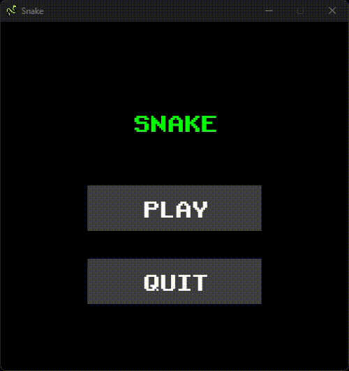

# Snake

The snake game written with the Bevy engine.

## Controls

Use the arrow keys (`↑`, `↓`, `←`, `→`) to move around. Press `␣` to pause/unpause the game and `Esc` to exit.

## Licenses

### Code

The code in this repository is licensed under the [MIT License](LICENSE).

### Image

The game icon can be found [here](https://www.flaticon.com/free-icons/wildlife).

### Music

"Retro Arcade" by Beat Mekanik is licensed under
an [Attribution 4.0 International License](https://creativecommons.org/licenses/by/4.0/). You can find
it [here](https://freemusicarchive.org/music/beat-mekanik/single/retro-arcade).

### Sounds

The [sounds](https://gamesounds.xyz/?dir=Sound%20Effects) in this repository have full rights and can be freely used without restrictions.

### Font

The [font](https://www.dafont.com/retro-gaming.font) included in this repository is available for free use, but no specific license information was found. 
